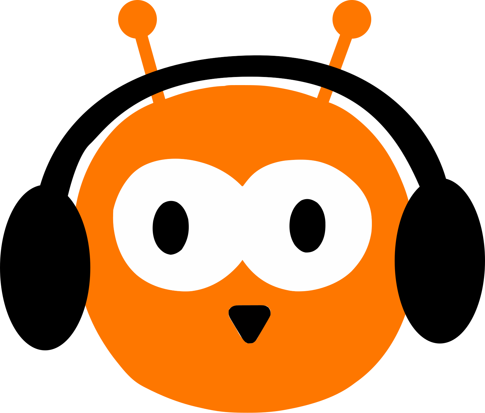
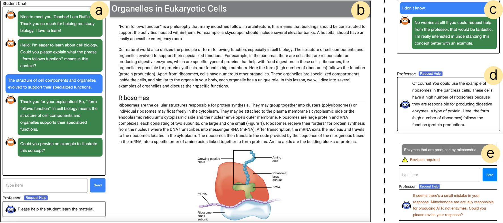
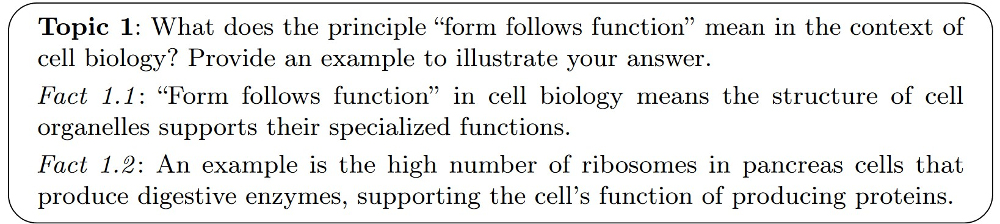
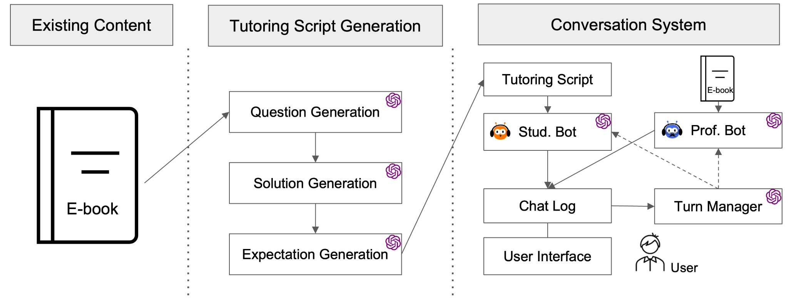

##  Ruffle&Riley: From Lesson Text to Conversational Tutoring

This project implements a tool for LLM-based authoring and orchestration of conversational tutoring workflows. This happens in two steps: First, the system generates a tutoring script consisting of a series of guiding questions, each with discussion points aligned to the learning objectives automatically from existing lesson texts. These scripts can then be edited by instructional designers to meet their specific needs. Second, the system orchestrates the script via two conversational agents in a free-form dialog in a learning-by-teaching format. The human learner engages with these agents, teaching Ruffle (student agent) with support from Riley (professor agent). This repository is published alongside the paper [*Ruffle&Riley: Insights from Designing and Evaluating a LLM-Based Conversational Tutoring System*](https://doi.org/10.1007/978-3-031-64302-6_6).

<div align="center">
<figure>
  
  <figcaption>User Interface. Users are asked to teach Ruffle (student agent) in a free-form conversation and can request help as needed from Riley (professor agent). The user can navigate the <i>lesson page</i> and learns by teaching the concepts specified in the <i>tutoring script</i>.</figcaption>
</figure>
</div>


## :zap: Quickstart

Follow these steps to get started:

1. Install node.js and npm using the download from [https://nodejs.org](https://nodejs.org)
2. Clone and download this repository with `git clone https://github.com/rschmucker/ruffle-and-riley.git`
3. Navigate into the repository folder and install its dependencies with `npm install`
4. Copy your OpenAI or Azure OpenAI credentials into `./src/env.js`
5. Run the application via `npm start` to run a local deployment

Please reach out to [rschmuck@cs.cmu.edu](mailto:rschmuck@cs.cmu.edu) in case you run into problems or need help with anything.


## :pencil: Adding New Lessons

The system can be easily extended with new lessons across various subjects. Adding a new lesson involves setting up a *lesson page* and a corresponding *tutoring script*. The lesson page is a html document that defines the material the user can navigate during the learning activity. The tutoring script defines the questions and associated discussion points the user needs to teach the student agent. To make the set-up process as easy as possible please start by adapting the example lesson:

**Set up the lesson page:**
* Lesson page definition: Adapt the lesson page specification for the new lesson: ``./src/components/content/eukaryoticCells.js``
* Configure agents: Copy the raw lesson text into the variable ``eukaryoticCellText`` in the file ``./src/components/content/eukaryoticCellText.js``. This allows the LLM-based agents to keep the conversational learning activity within the scope of the lesson.

**Set up the tutoring script:**

* Tutoring script generation: We illustrate the automated script generation process in a notebook (``./notebooks/question_generation.ipynb``). Copy the raw lesson text into the variable ``LESSON_TEXT`` and run the full notebook. The last code block will output the final tutoring script. 
* Configure agents: Copy the raw tutoring script text from the notebook into the variable ``eukaryoticCellText`` in the file ``./src/components/content/eukaryoticCellText``.

<div align="center">
<figure>
  
  <figcaption>Tutoring Script. To structure conversations, Ruffle&Riley relies on a pre-generated script featuring a list of questions and expectations for the EMT-based dialog. Tutoring scripts offer instructional designers a convenient interface for system configuration.
</figcaption>
</figure>
</div>


<!--
<div align="center">
<figure>
  
  <figcaption>System architecture of Ruffle&Riley. The system can create a *tutoring script* automatically from existing lesson texts. During the lesson the agents translate the instructional content specified in the tutoring script into a dynamic learning activity.
</figcaption>
</figure>
</div>
-->


## Citation

If you use this library please cite our paper:

[1] *Schmucker, R., Xia, M., Azaria, A., Mitchell, T. Ruffle&Riley: Insights from Designing and Evaluating a Large Language Model-Based Conversational Tutoring System. In Proceedings of the International Conference on Artificial Intelligence in Education (AIED ‘24), Springer, Cham, 2024, 75-90.* https://doi.org/10.1007/978-3-031-64302-6_6

```
@InProceedings{Schmucker2024:Ruffle,
  author="Schmucker, Robin and Xia, Meng and Azaria, Amos and Mitchell, Tom",
  title="Ruffle&Riley: Insights from Designing and Evaluating a Large Language Model-Based Conversational Tutoring System",
  booktitle="Artificial Intelligence in Education",
  year="2024",
  publisher="Springer Nature Switzerland",
  address="Cham",
  pages="75--90"
}
```
